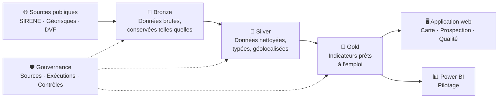

<div align="center">

# 🏭 DOCKZ

### La plateforme data du marché de l'entrepôt en Île-de-France

**Qui occupe les entrepôts ? Qui cherche de la place ? Que se vend-il, où, et à quel prix ?**
DOCKZ répond à ces questions avec des données publiques réelles, contrôlées et mises à jour automatiquement.


</div>

---

## 📌 En une minute

**ERBC** est un conseil en immobilier d'entreprise *(société fictive créée pour ce projet)*. Sa ligne métier **Industrial & Logistics** aide des entreprises à trouver, louer ou acheter des entrepôts et des locaux d'activité.

Au quotidien, ses consultants ont besoin de trois choses :

| Besoin | La question qu'ils se posent | Ce que DOCKZ apporte |
|:--|:--|:--|
| 🗺️ **Connaître le marché** | Où sont les entrepôts ? Le marché ralentit-il ? | Une carte du parc logistique et des indicateurs par département |
| 🎯 **Trouver des clients** | Quelles entreprises pourraient avoir besoin d'un entrepôt ? | Une base de prospection filtrable, avec un score de priorité et un export Excel |
| 📊 **Piloter l'activité** | Combien de demandes, à quel stade, avec quel résultat ? | Des tableaux de bord et un formulaire qui alimente la base automatiquement |

Le tout repose sur une règle simple : **chaque chiffre affiché indique d'où il vient et de quand il date.**

---

## 🧭 Les sources de données

Toutes les données sont **publiques, gratuites et sous Licence Ouverte**. Aucune donnée inventée.

| Source | Producteur | Ce qu'on y trouve | À quoi ça sert dans DOCKZ |
|:--|:--|:--|:--|
| 🏢 **SIRENE** *(API Recherche d'entreprises)* | INSEE / DINUM | Les entreprises françaises : activité, effectif, adresse, coordonnées | La base de prospection |
| 🏭 **Géorisques** *(installations classées)* | Ministère de la Transition écologique | Les sites industriels et les grands entrepôts soumis à réglementation, géolocalisés | La carte du parc logistique |
| 💶 **DVF** *(Demandes de valeurs foncières)* | DGFiP / Etalab | Toutes les ventes immobilières, avec prix et surface | Les transactions et les prix |
| 🏗️ **Sitadel** *(à venir)* | SDES | Les permis de construire, dont les entrepôts | L'offre future |

> 💡 **Pourquoi Géorisques ?** Un entrepôt couvert d'une certaine taille doit être déclaré au titre de la réglementation sur les installations classées (rubrique **1510**). C'est donc l'une des rares sources publiques qui localise réellement les grands entrepôts.

---

## 📈 Ce que les données disent déjà

Ces chiffres sont issus des premières ingestions. Ils seront consolidés dans les prochaines étapes.

### Les entreprises ciblées

**8 972 établissements** d'entreprises de **10 salariés et plus** ont été collectés en Île-de-France, dans 9 activités liées à la logistique : entreposage, messagerie, affrètement, transport routier de marchandises, vente à distance et livraison.

| 75 | 77 | 78 | 91 | 92 | 93 | 94 | 95 |
|:-:|:-:|:-:|:-:|:-:|:-:|:-:|:-:|
| 1 731 | 1 149 | 498 | 862 | 903 | 1 649 | 1 068 | 1 112 |

*Établissements collectés par département, avant contrôles qualité.*

### Le parc d'installations classées

**11 524 installations** recensées en Île-de-France. Parmi elles, **environ 450** mentionnent la rubrique 1510 des entrepôts couverts *(chiffre à confirmer par un filtrage exact)*.

### Le marché des locaux d'activité

**58 186 ventes** de locaux industriels, commerciaux ou assimilés entre 2021 et 2025.

| Département | Ventes 2021 | Ventes 2025 | Évolution |
|:--|--:|--:|--:|
| 75 · Paris | 3 555 | 3 496 | **-2 %** |
| 77 · Seine-et-Marne | 1 750 | 1 262 | **-28 %** |
| 78 · Yvelines | 1 560 | 1 009 | **-35 %** |
| 91 · Essonne | 1 187 | 887 | **-25 %** |
| 92 · Hauts-de-Seine | 1 551 | 1 185 | **-24 %** |
| 93 · Seine-Saint-Denis | 1 278 | 831 | **-35 %** |
| 94 · Val-de-Marne | 1 138 | 871 | **-23 %** |
| 95 · Val-d'Oise | 1 150 | 798 | **-31 %** |

> ⚠️ **À lire avec prudence.** Cette catégorie mélange boutiques et locaux d'activité. À Paris, il s'agit surtout de commerces. La date de couverture exacte du fichier 2025 reste à vérifier. La prochaine étape sépare les ventes par taille de surface pour isoler les vrais locaux logistiques.

---

## ⚙️ Comment ça marche

Les données traversent trois étapes, comme dans une chaîne de préparation : on reçoit le brut, on le nettoie, puis on le met en forme pour l'usage.



| Étape | En clair |
|:--|:--|
| 🥉 **Bronze** | On stocke la donnée exactement comme on l'a reçue. Si une erreur apparaît plus tard, on peut toujours revenir à l'original. |
| 🥈 **Silver** | On nettoie : bons formats, doublons retirés, données personnelles exclues, coordonnées vérifiées. |
| 🥇 **Gold** | On calcule ce dont les équipes ont besoin : parc par département, prospects classés, prix médians. |
| 🛡️ **Gouvernance** | Chaque exécution est tracée, chaque source est documentée, chaque contrôle est enregistré. |

Les mises à jour se font **automatiquement chaque semaine**. En cas d'échec, une alerte est envoyée sur téléphone.

---

## 🛡️ Qualité et gouvernance des données

Un outil de décision ne vaut que par la confiance qu'on peut lui accorder. DOCKZ affiche donc ses propres contrôles au lieu de les cacher.

### Les contrôles déjà en place

| Contrôle | Résultat | Pourquoi c'est important |
|:--|:--|:--|
| 👤 Personnes physiques exclues | **13** sur 8 972 | Un entrepreneur individuel est une personne : ses données relèvent du RGPD et n'ont pas leur place dans une base de prospection B2B |
| 🔒 Établissements non diffusibles exclus | **6** sur 8 972 | Ces entreprises ont demandé que leurs informations ne soient pas diffusées. On respecte ce choix |
| 📍 Établissements sans coordonnées | **111** sur 8 953 *(1,2 %)* | Ils restent dans la base, mais ne peuvent pas apparaître sur la carte |

### Les pièges repérés dans les données

- **💶 Ventes en double dans DVF.** Une vente qui porte sur plusieurs biens apparaît sur plusieurs lignes, avec le même prix total répété. C'est le cas de **23 % des ventes** étudiées. Calculer un prix au m² ligne par ligne surestimerait tout. Règle retenue : **une vente = une ligne**, surfaces additionnées, prix compté une seule fois.
- **🏭 Installations « Non ICPE » dans une base ICPE.** **4 223 installations** sur 11 524 sont classées « Non ICPE ». Elles sont conservées, mais signalées et exclues du parc d'entrepôts.
- **📋 Rubriques absentes.** Seules les installations soumises à **enregistrement** ou **autorisation** ont leurs rubriques détaillées. Les plus petits entrepôts, soumis à simple déclaration, ne sont pas identifiables par cette voie.

### Les limites assumées

| Ce que DOCKZ ne fait pas | Pourquoi |
|:--|:--|
| ❌ Pas de loyers ni de surfaces louées | Ces chiffres appartiennent aux conseils en immobilier et ne sont pas publics |
| ❌ Pas d'Alsace-Moselle ni de Mayotte dans DVF | Ces territoires ne sont pas couverts par la source |
| ❌ Pas de garantie d'occupation | Une entreprise près d'un entrepôt n'en est pas forcément l'occupant : c'est un indice, pas une certitude |

---

## 🗺️ Feuille de route

| Phase | Contenu | Statut |
|:--|:--|:-:|
| **P0 · Fondations** | Ingestion SIRENE (Bronze et Silver) | ✅ |
| | Ingestion Géorisques (Bronze) et analyse des rubriques | ✅ |
| | Téléchargement et profilage DVF 2021 à 2025 | ✅ |
| | Silver Géorisques et DVF, filtrage des entrepôts | 🔄 |
| | Couche Gold et contrôles qualité complets | ⏳ |
| | Application web : carte, prospection avec export Excel, page Qualité | ⏳ |
| | Mise à jour automatique hebdomadaire et mise en ligne | ⏳ |
| **P1 · Usage métier** | Rapport Power BI de pilotage | ⏳ |
| | Formulaire « dépôt de besoin client » avec enrichissement automatique | ⏳ |
| | Note de marché trimestrielle rédigée automatiquement à partir des chiffres | ⏳ |
| | Ajout des permis de construire d'entrepôts (Sitadel) | ⏳ |
| **P2 · Adoption** | Fiche prospect générée à partir d'un numéro SIREN | ⏳ |
| | Assistant de recherche dans la documentation publique du secteur | ⏳ |
| | Cahier des charges, guide utilisateur, support d'atelier de formation | ⏳ |

✅ terminé · 🔄 en cours · ⏳ à venir

---

## 🧰 Technologies

| Rôle | Outils |
|:--|:--|
| Collecte et traitement | Python, requests, DuckDB, pandas |
| Base de données | Supabase (PostgreSQL), PostGIS pour la géographie |
| Automatisation | GitHub Actions, alertes ntfy.sh |
| Application web | Next.js 15, TypeScript, Tailwind CSS, shadcn/ui |
| Cartographie | MapLibre GL, fonds OpenFreeMap |
| Pilotage | Power BI Desktop, export Excel |
| Hébergement | Vercel |

---

## 📁 Organisation du dépôt

```
dockz/
├── pipelines/
│   ├── common/db.py            Connexion base et suivi des exécutions
│   ├── sirene_ingest.py        Entreprises ciblées (SIRENE)
│   ├── georisques_ingest.py    Installations classées (Géorisques)
│   ├── georisques_probe.py     Test de l'API Géorisques
│   └── dvf_download.py         Téléchargement et profilage des ventes (DVF)
├── sql/
│   └── 001_schema.sql          Structure de la base (bronze, silver, gold, gov)
├── web/                        Application Next.js (à venir)
├── data/raw/                   Fichiers bruts téléchargés (non versionnés)
└── requirements.txt
```

---

## 🚀 Lancer le projet

**Prérequis :** Python 3, un projet Supabase avec PostGIS activé.

```powershell
git clone https://github.com/heykelh/dockz.git
cd dockz
python -m venv .venv
.\.venv\Scripts\Activate.ps1
python -m pip install -r requirements.txt
```

Créer un fichier `.env` à partir de `.env.example`, puis exécuter `sql/001_schema.sql` dans l'éditeur SQL de Supabase.

```powershell
python -m pipelines.sirene_ingest        # entreprises ciblées
python -m pipelines.georisques_ingest    # installations classées
python -m pipelines.dvf_download         # ventes immobilières
```

---

<div align="center">

**DOCKZ** · projet portfolio data et gouvernance · données publiques sous Licence Ouverte
ERBC est une société fictive, créée pour illustrer un cas d'usage réaliste.

[GitHub](https://github.com/heykelh) · [Portfolio](https://heykelhachiche.com)

</div>
