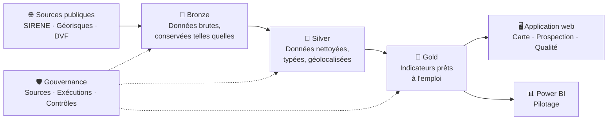

<div align="center">

# 🏭 DOCKZ

### La plateforme data du marché de l'entrepôt en Île-de-France

**Qui possède les entrepôts ? Qui les occupe ? Qui pourrait en chercher ? Que se vend-il, où, et à quel prix ?**
DOCKZ répond à ces questions avec des données publiques réelles, contrôlées et mises à jour automatiquement.


</div>

---

## 📌 En une minute

**ERBC** est un conseil en immobilier d'entreprise *(société fictive créée pour ce projet)*. Sa ligne métier **Industrial & Logistics** aide des entreprises à trouver, louer ou acheter des entrepôts et des locaux d'activité.

Au quotidien, ses consultants ont besoin de trois choses :

| Besoin | La question qu'ils se posent | Ce que DOCKZ apporte |
|:--|:--|:--|
| 🗺️ **Connaître le marché** | Où sont les entrepôts ? Le marché ralentit-il ? | Une carte des 425 grands entrepôts franciliens et des indicateurs par département |
| 🎯 **Trouver des clients** | Quelles entreprises pourraient avoir besoin d'un entrepôt ? | 8 953 entreprises classées par un score de priorité lisible, avec export Excel |
| 📊 **Piloter l'activité** | Combien de demandes, à quel stade, avec quel résultat ? | Des tableaux de bord et un formulaire qui alimente la base automatiquement |

Le tout repose sur une règle simple : **chaque chiffre affiché indique d'où il vient et de quand il date.**

---

## 🧭 Les sources de données

Toutes les données sont **publiques, gratuites et sous Licence Ouverte**. Aucune donnée inventée.

| Source | Producteur | Ce qu'on y trouve | À quoi ça sert dans DOCKZ |
|:--|:--|:--|:--|
| 🏢 **SIRENE** *(API Recherche d'entreprises)* | INSEE / DINUM | Les entreprises françaises : activité, effectif, adresse, coordonnées | La base de prospection et l'identification des exploitants |
| 🏭 **Géorisques** *(API installations classées)* | Ministère de la Transition écologique | Les sites soumis à réglementation, géolocalisés, avec leurs activités détaillées | Le parc des grands entrepôts |
| 💶 **DVF** *(Demandes de valeurs foncières)* | DGFiP / Etalab | Toutes les ventes immobilières, avec prix et surface | Les transactions et les prix |
| 🏗️ **Sitadel** *(à venir)* | SDES | Les permis de construire, dont les entrepôts | L'offre future |

> 💡 **Pourquoi Géorisques ?** Un grand entrepôt couvert doit être déclaré au titre de la réglementation sur les installations classées, sous la rubrique **1510**. C'est l'une des rares sources publiques qui localise réellement les grands entrepôts.

---

## 📈 Ce que les données révèlent

### 🏭 Le parc des grands entrepôts

**425 entrepôts** classés sous la rubrique 1510 en Île-de-France, pour un volume autorisé total d'environ **104 millions de m³**.

| Département | Entrepôts | dont autorisation | dont enregistrement | Volume autorisé (m³) | Exploitants distincts |
|:--|--:|--:|--:|--:|--:|
| 77 · Seine-et-Marne | **158** | 42 | 107 | 43 794 962 | 132 |
| 95 · Val-d'Oise | **82** | 11 | 74 | 20 048 003 | 68 |
| 91 · Essonne | **64** | 14 | 49 | 18 432 785 | 47 |
| 78 · Yvelines | 34 | 7 | 20 | 5 394 998 | 28 |
| 93 · Seine-Saint-Denis | 33 | 9 | 22 | 7 970 385 | 28 |
| 94 · Val-de-Marne | 28 | 4 | 24 | 5 386 151 | 20 |
| 92 · Hauts-de-Seine | 23 | 2 | 19 | 2 519 857 | 18 |
| 75 · Paris | 3 | 2 | 1 | 881 952 | 3 |

**Trois départements, la Seine-et-Marne, le Val-d'Oise et l'Essonne, concentrent 72 % du parc.**

> ⚠️ Le volume affiché est celui **autorisé par l'administration**, pas forcément construit ni occupé. Les régimes « autorisation » et « enregistrement » correspondent à des seuils de taille : ce sont les plus grands entrepôts.

### 🔑 L'observation clé : le déclarant n'est souvent pas l'occupant

L'activité la plus fréquente chez les exploitants déclarés est la **location de biens immobiliers (107 entrepôts sur 425)**. On y trouve des foncières comme ARGAN, SEGRO ou Logicor, ainsi que les ports de Paris et de l'axe Seine.

Autrement dit, **l'exploitant officiel d'un entrepôt est souvent le propriétaire, et non l'entreprise qui l'occupe.** Pour un conseil en immobilier, cela fait deux cibles :

| Cible | Ce qu'on leur propose | Comment DOCKZ les repère |
|:--|:--|:--|
| 🏦 **Propriétaires et investisseurs** | Mandats de commercialisation, arbitrages | Exploitants déclarés des entrepôts |
| 🚚 **Occupants** | Nouveaux locaux, extension, renégociation | Entreprises logistiques installées à proximité immédiate des entrepôts |

### 💶 Le marché des locaux d'activité

**58 186 ventes** de locaux industriels, commerciaux ou assimilés entre 2021 et 2025, dont **38 995** avec un prix au m² fiable.

**Plus le local est grand, moins le m² est cher** (prix médians 2025, Île-de-France) :

| Taille du local | Ventes avec prix | Prix médian au m² |
|:--|--:|--:|
| Moins de 300 m² *(surtout des commerces)* | 5 576 | **4 501 €** |
| 300 à 1 000 m² | 956 | **1 768 €** |
| 1 000 à 5 000 m² | 596 | **1 112 €** |
| 5 000 m² et plus | 129 | **884 €** |

**Les ventes de grands locaux reculent de 29 % en quatre ans** (1 000 m² et plus) :

| 2021 | 2022 | 2023 | 2024 | 2025 |
|:-:|:-:|:-:|:-:|:-:|
| 1 337 | 1 309 | 1 041 | 975 | **951** |

> ⚠️ La date de couverture exacte du fichier 2025 reste à confirmer auprès de la source.

### 🎯 Les prospects

**8 953 établissements** d'entreprises de **10 salariés et plus**, dans 9 activités liées à la logistique : entreposage, messagerie, affrètement, transport routier, vente à distance et livraison.

| Score | Établissements |
|:--|--:|
| 70 et plus | **141** |
| 50 à 69 | 1 060 |
| 30 à 49 | 2 346 |
| Moins de 30 | 5 406 |

En tête du classement, on retrouve des acteurs majeurs de la logistique : DHL Supply Chain, IKEA Distribution, FM Logistic, GXO, Carrefour Supply Chain, ITM Logistique ou Fnac Logistique. C'est la meilleure validation d'une règle de scoring : **elle fait remonter des noms qu'un commercial du secteur reconnaît immédiatement.**

---

## 🧮 Comment le score est calculé

Le score est volontairement **simple et lisible**. Chaque critère est affiché séparément, pour que le commercial comprenne immédiatement pourquoi une entreprise est bien classée.

| Critère | Règle | Points |
|:--|:--|--:|
| 🏷️ **Activité** | Entreposage 30 · Vente à distance 25 · Messagerie et affrètement 20 · Transport routier 15 · Livraison 10 | jusqu'à **30** |
| 👥 **Effectif** | De 5 points (10 à 19 salariés) à 25 points (200 salariés et plus) | jusqu'à **25** |
| 🏭 **Lien avec un entrepôt** | Exploite un entrepôt classé : 35 · Situé à moins de 500 m d'un entrepôt classé : 25 | jusqu'à **35** |
| 🆕 **Site récent** | Établissement ouvert il y a moins de 5 ans, signe d'expansion | **10** |
| | **Total** | **100** |

Ces pondérations sont un point de départ. Dans un vrai déploiement, elles s'ajustent avec les équipes commerciales, à partir des affaires réellement signées.

Les prospects sont disponibles à deux niveaux : **par site** (avec l'adresse, pour la visite) et **par entreprise** (un compte client, plusieurs sites).

---

## ⚙️ Comment ça marche

Les données traversent trois étapes, comme dans une chaîne de préparation : on reçoit le brut, on le nettoie, puis on le met en forme pour l'usage.



| Étape | En clair |
|:--|:--|
| 🥉 **Bronze** | On stocke la donnée exactement comme on l'a reçue. Si une erreur apparaît plus tard, on peut toujours revenir à l'original. |
| 🥈 **Silver** | On nettoie : bons formats, doublons retirés, données personnelles exclues, coordonnées vérifiées, exploitants identifiés. |
| 🥇 **Gold** | On calcule ce dont les équipes ont besoin : parc par département, prospects classés, prix médians. |
| 🛡️ **Gouvernance** | Chaque exécution est tracée, chaque source est documentée, chaque contrôle est enregistré. |

Les mises à jour se font **automatiquement chaque semaine**. En cas d'échec, une alerte est envoyée sur téléphone.

---

## 🛡️ Qualité et gouvernance des données

Un outil de décision ne vaut que par la confiance qu'on peut lui accorder. DOCKZ affiche donc ses propres contrôles au lieu de les cacher.

### 🏢 Entreprises (SIRENE)

| Contrôle | Résultat | Pourquoi c'est important |
|:--|:--|:--|
| 👤 Personnes physiques exclues | **13** sur 8 972 | Un entrepreneur individuel est une personne : ses données relèvent du RGPD et n'ont pas leur place dans une base de prospection B2B |
| 🔒 Établissements non diffusibles exclus | **6** sur 8 972 | Ces entreprises ont demandé que leurs informations ne soient pas diffusées. Ce choix est respecté |
| 📍 Établissements sans coordonnées | **111** sur 8 953 *(1,2 %)* | Ils restent dans la base, mais n'apparaissent pas sur la carte |

### 🏭 Entrepôts (Géorisques)

| Contrôle | Résultat | Pourquoi c'est important |
|:--|:--|:--|
| 🔍 Filtrage exact de la rubrique 1510 | **425** entrepôts *(une recherche approximative en annonçait environ 450)* | Une méthode imprécise aurait surestimé le parc d'environ 7 % |
| ❓ Installations « Non ICPE » dans la base | **4 223** sur 11 524 | Conservées pour la traçabilité, mais exclues du parc |
| 🔢 Entrepôts sans SIRET valide | **42** sur 425 | Leur exploitant ne peut pas être identifié |
| 🔎 SIRET introuvable dans SIRENE | **2** sur 425 | Écart entre deux référentiels publics, à signaler |
| 📍 Entrepôts sans coordonnées | **0** sur 425 | Tout le parc est cartographiable |
| 🔒 Exploitants personnes physiques | Nom non affiché | Même règle RGPD que pour la prospection |

Certains déclarants sont des bureaux d'études ou des holdings, probablement des intermédiaires administratifs plutôt que des occupants. Ils sont identifiables grâce à leur code d'activité.

### 💶 Ventes (DVF)

| Contrôle | Résultat | Pourquoi c'est important |
|:--|:--|:--|
| 📑 Ventes comportant plusieurs lignes | **28 831** sur 58 186 | Une vente portant sur plusieurs biens apparaît sur plusieurs lignes avec le même prix répété. Règle retenue : **une vente = une ligne**, surfaces additionnées, prix compté une seule fois |
| 🏠 Ventes incluant un logement | **14 560** sur 58 186 | Leur prix couvre aussi le logement : elles sont exclues du calcul du prix au m² |
| 📐 Ventes sans surface bâtie | **1 518** sur 58 186 | Pas de prix au m² possible |
| ⚠️ Prix au m² aberrants | **1 295** sur 38 995 *(3,3 %)* | Signalés et exclus des médianes (seuils : moins de 50 € ou plus de 30 000 € le m²) |
| 📍 Ventes sans coordonnées | **1 142** sur 58 186 | Comptées dans les statistiques, absentes de la carte |

### 🚧 Les limites assumées

| Ce que DOCKZ ne fait pas | Pourquoi |
|:--|:--|
| ❌ Pas de loyers ni de surfaces louées | Ces chiffres appartiennent aux conseils en immobilier et ne sont pas publics |
| ❌ Pas de petits entrepôts | Les entrepôts sous le simple régime de déclaration n'ont pas leurs activités détaillées dans la source |
| ❌ Pas de séparation parfaite boutiques / entrepôts dans DVF | La source les regroupe dans une même catégorie : la taille du local sert d'indicateur |
| ❌ Pas d'Alsace-Moselle ni de Mayotte dans DVF | Ces territoires ne sont pas couverts par la source |
| ❌ Pas de garantie d'occupation | Une entreprise proche d'un entrepôt n'en est pas forcément l'occupant : c'est un indice, pas une certitude |

---

## 🗺️ Feuille de route

| Phase | Contenu | Statut |
|:--|:--|:-:|
| **P0 · Fondations** | Ingestion SIRENE (Bronze et Silver) | ✅ |
| | Ingestion Géorisques, entrepôts 1510 et identification des exploitants | ✅ |
| | Ventes DVF 2021 à 2025, une ligne par vente | ✅ |
| | Couche Gold : carte, parc, marché, prospects, qualité | ✅ |
| | Application web : carte, prospection avec export Excel, page Qualité | 🔄 |
| | Mise à jour automatique hebdomadaire et mise en ligne | ⏳ |
| **P1 · Usage métier** | Rapport Power BI de pilotage | ⏳ |
| | Formulaire « dépôt de besoin client » avec enrichissement automatique | ⏳ |
| | Note de marché trimestrielle rédigée automatiquement à partir des chiffres | ⏳ |
| | Ajout des permis de construire d'entrepôts (Sitadel) | ⏳ |
| **P2 · Adoption** | Fiche prospect générée à partir d'un numéro SIREN | ⏳ |
| | Assistant de recherche dans la documentation publique du secteur | ⏳ |
| | Cahier des charges, guide utilisateur, support d'atelier de formation | ⏳ |

✅ terminé · 🔄 en cours · ⏳ à venir

---

## 🧰 Technologies

| Rôle | Outils |
|:--|:--|
| Collecte et traitement | Python, requests, DuckDB, pandas |
| Base de données | Supabase (PostgreSQL), PostGIS pour la géographie |
| Automatisation | GitHub Actions, alertes ntfy.sh |
| Application web | Next.js 15, TypeScript, Tailwind CSS, shadcn/ui |
| Cartographie | MapLibre GL, fonds OpenFreeMap |
| Pilotage | Power BI Desktop, export Excel |
| Hébergement | Vercel |

---

## 📁 Organisation du dépôt

```
dockz/
├── pipelines/
│   ├── common/db.py            Connexion base et suivi des exécutions
│   ├── sirene_ingest.py        Entreprises ciblées (Bronze et Silver)
│   ├── georisques_probe.py     Test de l'API Géorisques
│   ├── georisques_ingest.py    Installations classées (Bronze)
│   ├── georisques_silver.py    Entrepôts 1510 et exploitants (Silver)
│   ├── dvf_download.py         Téléchargement et profilage des ventes
│   ├── dvf_silver.py           Une ligne par vente (Silver)
│   ├── build_gold.py           Rafraîchissement et synthèse de la couche Gold
│   └── apply_sql.py            Exécution des scripts SQL
├── sql/
│   ├── 001_schema.sql          Schémas, gouvernance, Bronze
│   ├── 002_silver.sql          Tables Silver
│   └── 003_gold.sql            Vues Gold
├── web/                        Application Next.js (en cours)
├── data/raw/                   Fichiers bruts téléchargés (non versionnés)
└── requirements.txt
```

---

## 🚀 Lancer le projet

**Prérequis :** Python 3, un projet Supabase avec PostGIS activé.

```powershell
git clone https://github.com/heykelh/dockz.git
cd dockz
python -m venv .venv
.\.venv\Scripts\Activate.ps1
python -m pip install -r requirements.txt
```

Créer un fichier `.env` à partir de `.env.example`, puis exécuter les fichiers du dossier `sql/` dans l'ordre, dans l'éditeur SQL de Supabase.

```powershell
# 1. Collecte
python -m pipelines.sirene_ingest
python -m pipelines.georisques_ingest
python -m pipelines.dvf_download

# 2. Nettoyage
python -m pipelines.georisques_silver
python -m pipelines.dvf_silver

# 3. Indicateurs
python -m pipelines.build_gold
```

---

<div align="center">

**DOCKZ** · projet portfolio data et gouvernance · données publiques sous Licence Ouverte
ERBC est une société fictive, créée pour illustrer un cas d'usage réaliste.

[GitHub](https://github.com/heykelh) · [Portfolio](https://heykelhachiche.com)

</div>
